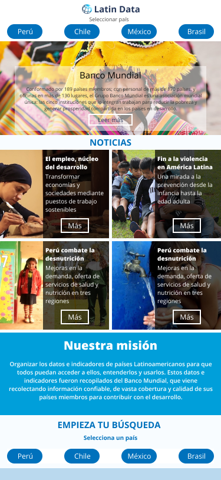

# Data Lovers

## Índice

- [Índice](#índice)
- [Título](#titulo)
- [Introducción](#introduccion)
- [Resumen del Proyecto](#resumen-del-proyecto)
- [Investigación UX](#imagen-del-proyecto-final)
  - [Usuario y objetivo en Relación al Producto](#usuario-y-objetivo-en-relacion-al-producto)
  - [Problema y Necesidades que resuelve](#problema-y-necesidades-que-resuelve)
  - [Resumen del Feedback](#resumen-del-feedback)
  - [Imagen y link del prototipo en Figma](#imagen-y-link-del-prototipo-en-Figma)

## Título

# **Latin Data**

## Introducción

En pleno siglo XXI la información acerca de datos e indicadores de páginas Web y/o aplicaciones no cuenta con el valor necesario.
Conforme a ello se realizó un estudio en el cual se observó que existen escasos medios que brindan información de datos e indicadores. El Banco Mundial cumple con esta función, sin embargo su trasfondo tiene como objetivo combatir la pobreza extrema ayudando a países que necesiten concretar proyectos para beneficiar a un conjunto de personas.

Sin embargo, se entiende que el usuario requiere información más precisar, por ello se propuso como solución conectar y hacer accesible el ingreso a ciertos datos de países Latinoamericanos no solo para analizar y recopilar información sino también para estar al tanto de la realidad en la que se encuentran estos país, para afianzar la información se unió un conjunto de noticias relacionadas con los temas, deseando así una experiencia confiable y rápida de ingresar.

## Resumen del Proyecto

El proyecto “Latin Data” busca facilitar el acceso a datos e indicadores de países Latinoamericanos  con la finalidad de hacer más eficiente la búsquedad del usuario.
El ingreso a esta plataforma se realizará a través del usuario y contraseña “LABORATORIA”.

### Problema que resuelve

Diariamente se requieren de datos para conocimiento, análisis y toma de decisiones, lo cual usualmente son buscados en Google u otras plataformas. Sin embargo los datos encontrados no siempre pueden ser filtrados, seleccionados y ordenados lo que hace más complicada la obtención de esta información, por ello se desarrolla la plataforma “Latin Data” con la finalidad de facilitar el acceso a datos que incluyen indicadores demográficos, económicos y comerciales de los países Latinoamericanos como Perú, México, Chile y Brasil.
Observando esta situación se planificó el proyecto "Latin Data" que se desarrolla ante la problemática de inaccesibilidad inmediata y rápida de datos que incluyen indicadores de ciertos países Latinoamericanos como lo son Perú, México, Chile y Brasil.

## Investigación UX

### **Necesidades:**

1. Visualización de datos estadísticos de fuente confiable, de forma ordenada ascendentemente o descendentemente según año y tipo de indicador, filtrado de resultados según año además visualizar una tendencia promedio del indicador para un determinado país.

2. El producto debe funcionar para todos los posibles casos, es decir, que aplique para cualquier País seleccionado y cualquier indicador seleccionado.

3. Debe ser de fácil acceso para todos, se debe poder retroceder o avanzar.

4. Debe tener un diseño agradable, que organice correctamente la información.

### Usuario y objetivo en Relación al Producto

Este proyecto está orientado a estudiantes, analistas, ejecutivos, autoridades públicas y/o profesionales de cualquier especialidad, que requieran de datos de buena calidad para fijar niveles de referencia, identificar medidas públicas y privadas eficaces, determinar objetivos y metas, supervisar avances y evaluar efectos. Además, la información representa una herramienta fundamental para una buena gestión, puesto que es un medio para que las personas evalúen la labor del gobierno y puedan participar directamente en el proceso de desarrollo.

### Diseño del Prototipo

                           Prototipo en baja fidelidad ( Web )

                           Prototipo en baja fidelidad ( Movil )

## Imagen y link del prototipo en Figma (Prototipo inicial)

                            Prototipo en alta fidelidad 

## **Login**

## **Pantalla "Quiénes Somos"** 

## **Pantalla activada al seleccionar un país** 

## **Pantalla activada al seleccionar un tipo de indicador** 

## **Pantalla activada al seleccionar un indicador** 

A través del siguiente Link se podrá obtener el figma de las Historias de Usuario planteadas.  https://www.figma.com/file/eEgDuL4cbCJMbdN7TrvhrTPi/Latin-Data?node-id=0%3A1

## Resumen del Feedback inicial

## Prueba de Usabilidad

## Imagen final del Proyecto

                            Prototipo final en Alta Fidelidad

## **Login**

## **Pantalla "Quiénes Somos"** 

## **Pantalla activada al seleccionar un país** 

## **Pantalla activada al seleccionar un tipo de indicador** 

## **Pantalla activada al seleccionar un indicador** 

A través del siguiente Link se podrá obtener el figma de las Historias de Usuario planteadas.  https://www.figma.com/file/JVEtXX4GBWx9CTADyo68f6/Latin-Data-(Copy)?node-id=103%3A238

